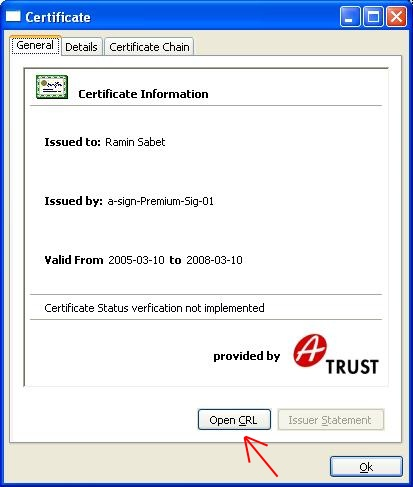
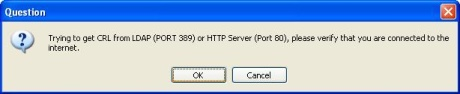
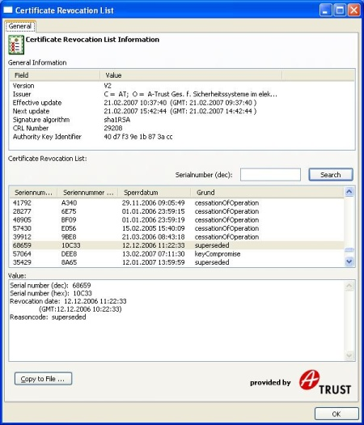

# Cert-andCRL-Viewer

A binary of the cert viewer can be found [here](binaries/).

---

The certificate viewer after a certificate file has been opened.

After Open CRL is selected, you will be asked if a connection to the Internet may be opened to download the CRL.

The loaded CRL is displayed, and in this case the first opened certificate was found in the list because it has been revoked.